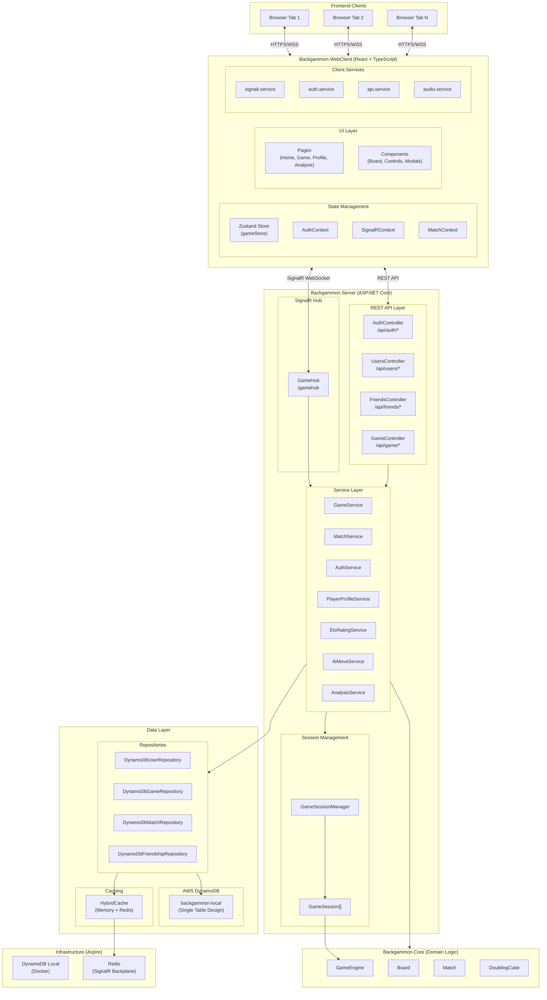
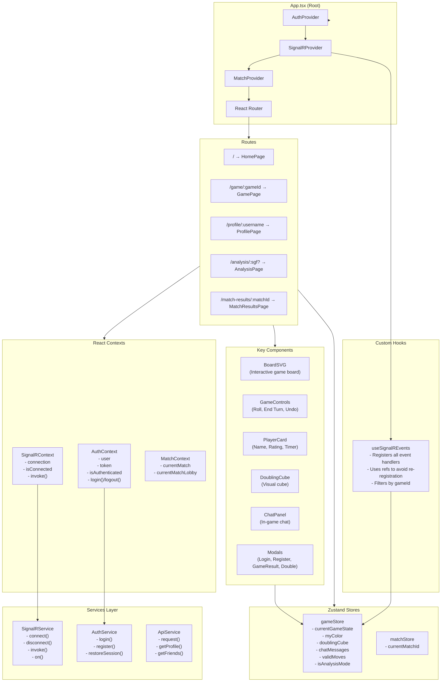
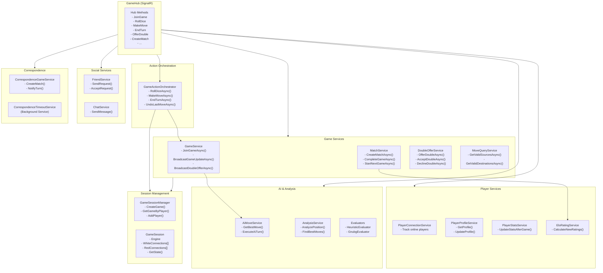
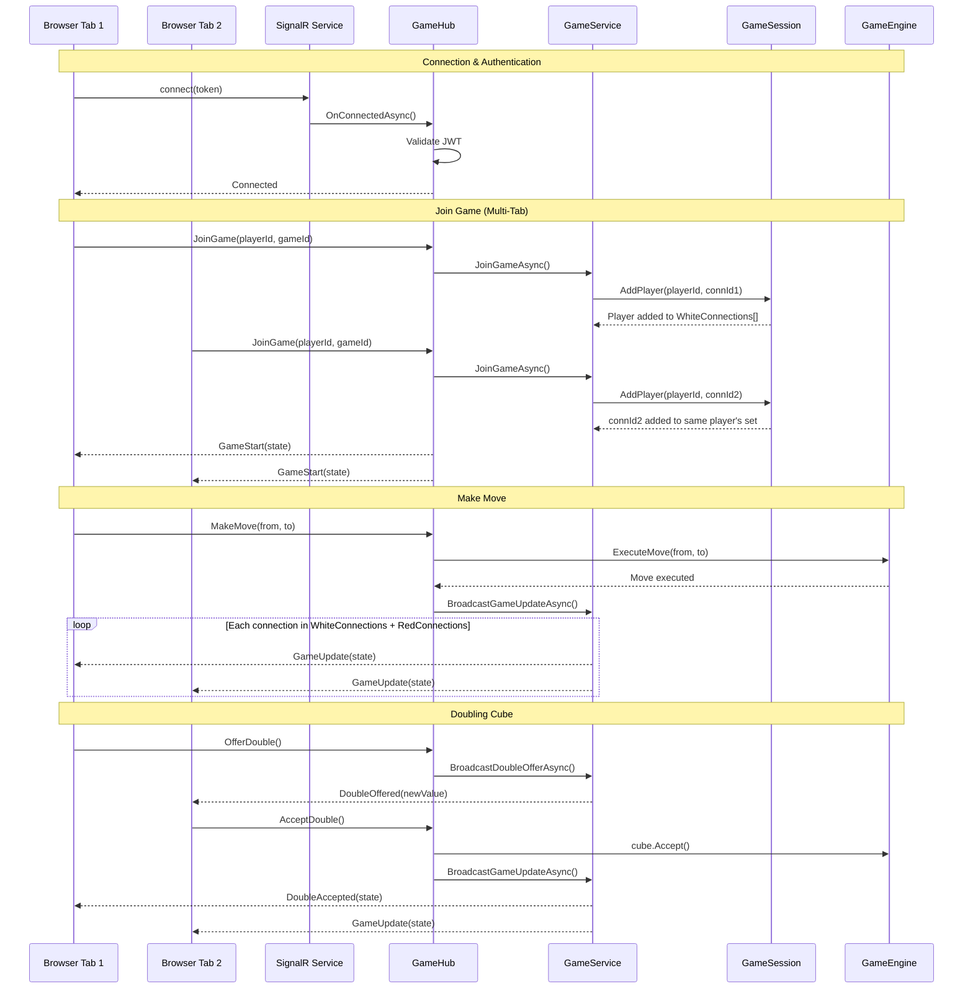
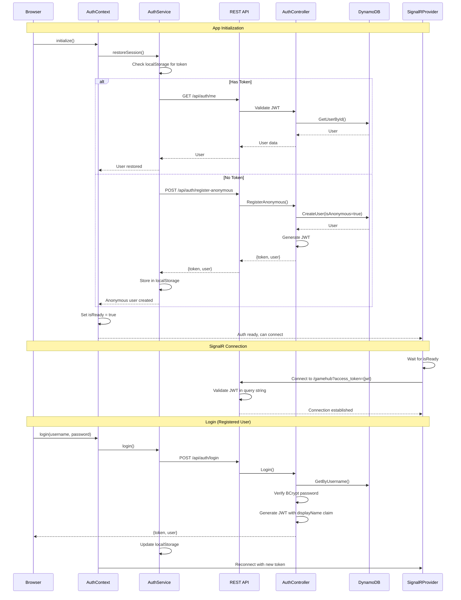
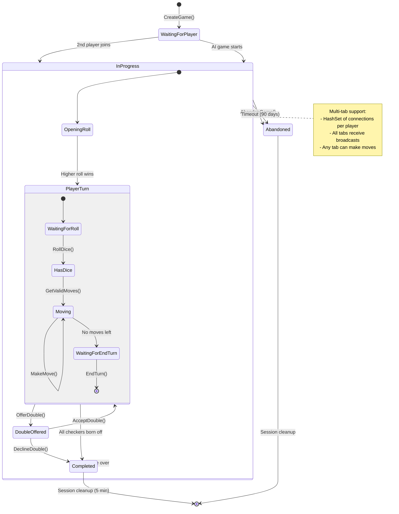
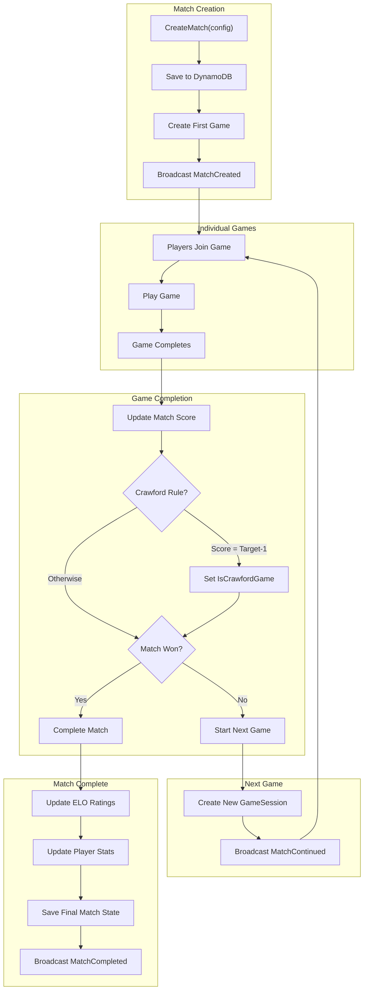
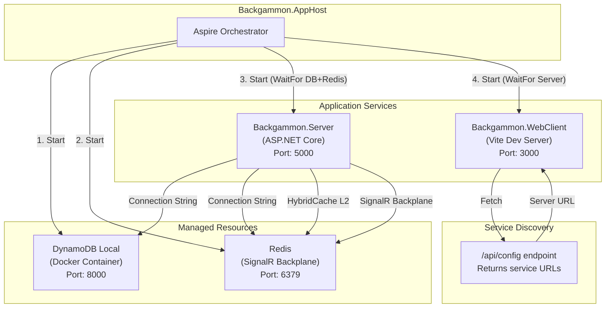

# Backgammon Architecture Deep Dive

## High-Level System Overview



---

## Frontend Architecture



---

## Backend Services Architecture



---

## SignalR Communication Flow



---

## DynamoDB Single-Table Design

```mermaid
erDiagram
    BACKGAMMON_TABLE {
        string PK "Partition Key"
        string SK "Sort Key"
        string GSI1PK "Username Index"
        string GSI1SK "Username Index SK"
        string GSI2PK "Email Index"
        string GSI2SK "Email Index SK"
        string GSI3PK "Status Index"
        string GSI3SK "Timestamp Sort"
        string GSI4PK "Correspondence Turn"
        string GSI4SK "Deadline Sort"
    }

    USER_PROFILE {
        string PK "USER#{userId}"
        string SK "PROFILE"
        string GSI1PK "USERNAME#{normalized}"
        string GSI2PK "EMAIL#{normalized}"
        string userId
        string username
        string displayName
        string email
        string passwordHash
        int rating
        int peakRating
        map stats "wins, losses, streaks"
        string profilePrivacy
    }

    GAME {
        string PK "GAME#{gameId}"
        string SK "METADATA"
        string GSI3PK "GAME_STATUS#{status}"
        string GSI3SK "timestamp_ticks"
        string gameId
        string status
        string whitePlayerId
        string redPlayerId
        list boardState
        int die1
        int die2
        string currentPlayer
        int doublingCubeValue
        string winner
        string matchId
    }

    PLAYER_GAME_INDEX {
        string PK "USER#{playerId}"
        string SK "GAME#{reversedTimestamp}#{gameId}"
        string gameId
    }

    MATCH {
        string PK "MATCH#{matchId}"
        string SK "METADATA"
        string GSI3PK "MATCH_STATUS#{status}"
        string GSI4PK "CORRESPONDENCE_TURN#{playerId}"
        string matchId
        string player1Id
        string player2Id
        int player1Score
        int player2Score
        int targetScore
        boolean isCrawfordGame
        string currentGameId
        list gameIds
        string opponentType
        boolean isCorrespondence
    }

    FRIENDSHIP {
        string PK "USER#{userId}"
        string SK "FRIEND#{status}#{friendUserId}"
        string friendUserId
        string friendUsername
        string status "Pending|Accepted|Blocked"
        string initiatedBy
    }

    BACKGAMMON_TABLE ||--o{ USER_PROFILE : "contains"
    BACKGAMMON_TABLE ||--o{ GAME : "contains"
    BACKGAMMON_TABLE ||--o{ PLAYER_GAME_INDEX : "contains"
    BACKGAMMON_TABLE ||--o{ MATCH : "contains"
    BACKGAMMON_TABLE ||--o{ FRIENDSHIP : "contains"
```

### Key Schema Patterns

| Entity | Partition Key (PK) | Sort Key (SK) | GSI Usage |
|--------|-------------------|---------------|-----------|
| User Profile | `USER#{userId}` | `PROFILE` | GSI1 (username), GSI2 (email) |
| Game | `GAME#{gameId}` | `METADATA` | GSI3 (status queries) |
| Player-Game Index | `USER#{playerId}` | `GAME#{reversedTS}#{gameId}` | None (per-player queries) |
| Match | `MATCH#{matchId}` | `METADATA` | GSI3 (status), GSI4 (turn) |
| Player-Match Index | `USER#{playerId}` | `MATCH#{reversedTS}#{matchId}` | None |
| Friendship | `USER#{userId}` | `FRIEND#{status}#{friendId}` | None |

---

## Authentication Flow



---

## Game Session Lifecycle



---

## Match Play Flow



---

## Infrastructure (Aspire Orchestration)



---

## Key File Locations

### Backend (Backgammon.Server)
| File | Purpose |
|------|---------|
| `Hubs/GameHub.cs` | SignalR hub - all real-time methods |
| `Program.cs` | DI setup, middleware, routes |
| `Services/GameService.cs` | Game creation, joining, broadcasting |
| `Services/GameActionOrchestrator.cs` | Move execution pattern |
| `Services/GameSession.cs` | Session state + multi-tab support |
| `Services/MatchService.cs` | Match lifecycle management |
| `Services/AuthService.cs` | JWT + BCrypt authentication |
| `Services/DynamoDb/*.cs` | Repository implementations |
| `Controllers/*.cs` | REST API endpoints |

### Frontend (Backgammon.WebClient)
| File | Purpose |
|------|---------|
| `src/App.tsx` | Root component + providers |
| `src/contexts/SignalRContext.tsx` | SignalR connection management |
| `src/contexts/AuthContext.tsx` | Authentication state |
| `src/hooks/useSignalREvents.ts` | Event handler registration |
| `src/stores/gameStore.ts` | Zustand game state |
| `src/services/signalr.service.ts` | SignalR service layer |
| `src/services/auth.service.ts` | Auth API calls |
| `src/pages/*.tsx` | Route pages |
| `src/components/game/*.tsx` | Game UI components |

### Core (Backgammon.Core)
| File | Purpose |
|------|---------|
| `GameEngine.cs` | Game rules + logic |
| `Board.cs` | Board representation |
| `Match.cs` | Match scoring + Crawford |
| `DoublingCube.cs` | Cube logic |
| `Move.cs` | Move representation |

---

## Summary

This architecture implements a **real-time multiplayer backgammon** application with:

1. **Frontend**: React + TypeScript + Vite with Zustand for state management
2. **Real-time**: SignalR WebSocket with multi-tab support and automatic reconnection
3. **Backend**: ASP.NET Core with clean service layer separation
4. **Domain**: Pure game logic in Backgammon.Core (no dependencies)
5. **Persistence**: DynamoDB single-table design with 4 GSIs for efficient queries
6. **Auth**: JWT + BCrypt with anonymous user support
7. **Infrastructure**: .NET Aspire orchestration with DynamoDB Local and Redis
